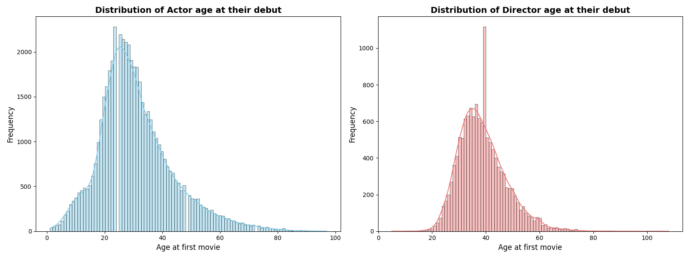

## Another try 

    

    <input type="range" id="image-slider" min="0" max="2" value="0" style="width: 100%;">

## Anotherother try 

    <select id="image-selector" style="width: 100%;">
        <option value=0>Actor-Director Behaviour</option>
        <option value=1>Actor-Movie Behaviour</option>
        <option value=2>Actor-Gender Behaviour</option>
    </select>

    

## JavaScript - Slider Change Image Example

This example lets you move a slider to select an image dynamically.

---

  <h4 style="color: black; text-align: center;">Move the slider to select an image</h4>
  

  

    <label for="image-slider">Choose a position:</label>
    <input type="range" id="image-slider" min="0" value="0" style="width: 80%; margin: 10px auto;" />
  

  

    
Image will appear here

  

## Try image time scrolling

Click on the `start` button to see the evolution of the newtork over time. 

    

<button id="action-button"> start </button>

